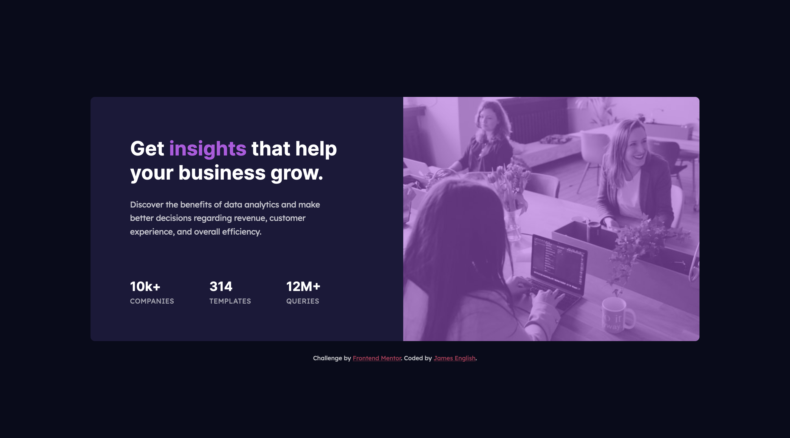
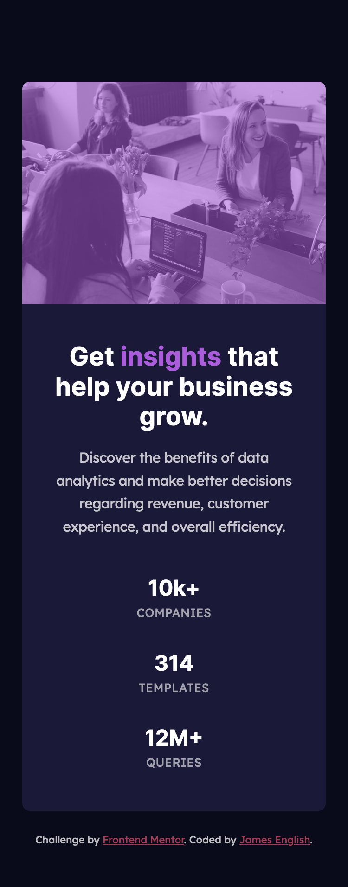

# Frontend Mentor - Stats preview card component solution

This is a solution to the [Stats preview card component challenge on Frontend Mentor](https://www.frontendmentor.io/challenges/stats-preview-card-component-8JqbgoU62). Frontend Mentor challenges help you improve your coding skills by building realistic projects. 

## Table of contents

- [Overview](#overview)
  - [The challenge](#the-challenge)
  - [Screenshots](#screenshots)
  - [Links](#links)
- [My process](#my-process)
  - [Built with](#built-with)
- [Author](#author)

## Overview

### The challenge

Users should be able to:

- View the optimal layout depending on their device's screen size

### Screenshots

### Links

- Solution URL: [Frontend Mentor](https://www.frontendmentor.io/solutions/css-flexbox-for-easy-switching-from-desktop-to-mobile-layout-sb9_8RkvD)
- Live Site URL: [Vercel](https://fem-stats-preview-card-component-ten.vercel.app/)

## My process

### Built with

HTML, CSS Flexbox

## Author

- Codepen - [@anglicus](https://codepen.io/anglicus)
- Frontend Mentor - [@anglicus](https://www.frontendmentor.io/profile/anglicus)
- FreeCodeCamp [@anglicus] (https://www.freecodecamp.org/anglicus)